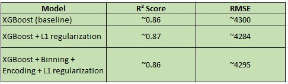

# Project Overview
This project aims to predict hospital charges for patients using machine learning techniques.
The dataset contains patient demographics and hospital-related attributes (such as age, gender, region, smoking status, etc.). The target variable is hospital charges (cost), which is continuous and highly skewed.

The problem is framed as a regression task, and multiple feature engineering techniques along with XGBoost Regressor were used to improve performance.

* Dataset
The dataset consists of records with the following features:
age → Patient age (18–64)
sex → Gender of patient
bmi → Body Mass Index
children → Number of dependents
smoker → Smoking status (yes/no)
region → Residential region (categorical)
charges → Target column → Hospital charges

* Preprocessing & Feature Engineering
  Target transformation
    Applied log transformation to hospital charges to reduce skewness.
    Predictions were inverse-transformed (exp) for evaluation.
  Binning
    Grouped patient ages into categories (18–25, 26–35, 36–45, 46–55, 56–64).
  Target Encoding
    Encoded categorical variables (e.g., region) using the mean hospital charges from training data.

* Feature Crossing
Interaction features like bmi × smoker were tested to capture non-linear effects.

* Train-Test Split
Standard 80-20 split used.

*Care taken to avoid data leakage during target encoding.

* Model
The primary model used is XGBoost Regressor with L1 regularization to prevent overfitting.
Why XGBoost?
* Handles non-linearities well
* Built-in regularization
* Works efficiently with tabular data

* Results

* Observation:
Feature engineering (binning + target encoding) did not drastically improve the score.
Regularization improved model stability and slightly reduced RMSE.
